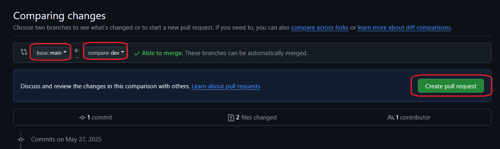
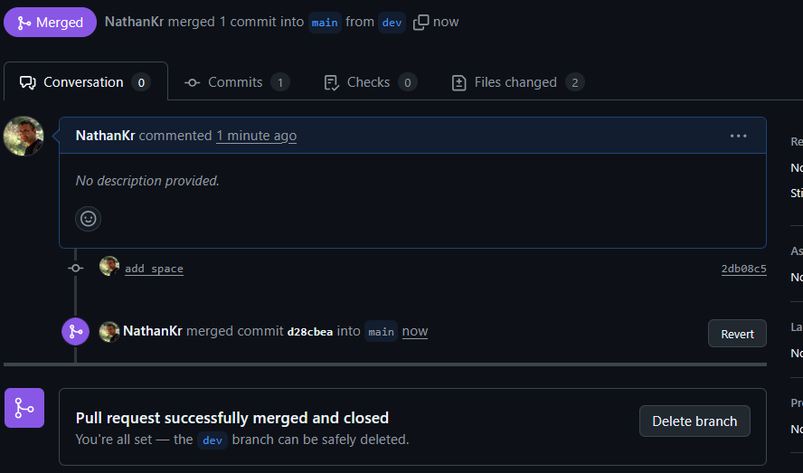
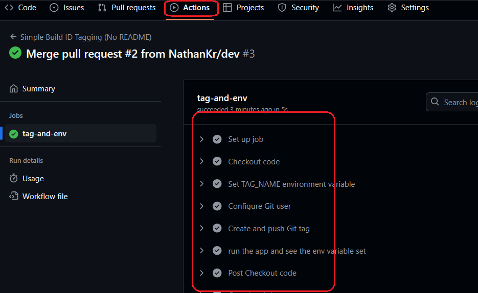
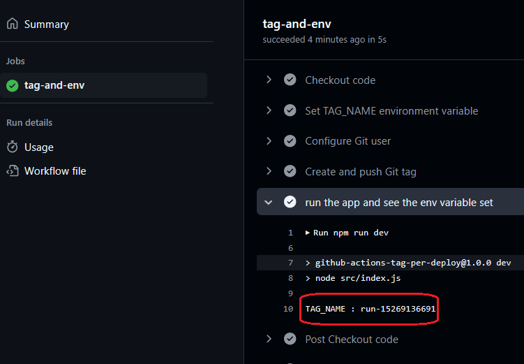
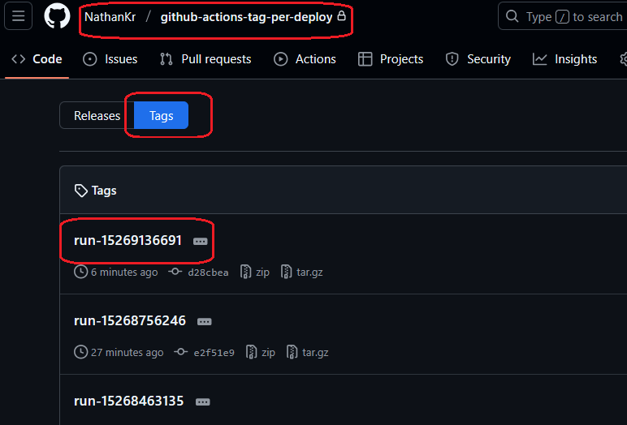

<h1>Project Name</h1>
Versioned Deployments with GitHub Actions

<h2>Project Description</h2>
"Versioned Deployments" provides a streamlined approach to uniquely identify each application deployment to production. By leveraging GitHub Actions' automatically incrementing `run_id`, this workflow creates a specific Git tag for every push to `main` and makes that tag available as an environment variable within your application. This ensures traceability for debugging, admin displays, and versioned content.

<h2>Motivation</h2>
<p>When deploying applications to production, associating specific code versions with live deployments is crucial. Traditional semantic versioning (e.g., 1.2.3) is often manually updated and doesn't always reflect every individual deployment. This project automates the creation of unique deployment tags, resolving key challenges:</p>
<ul>
    <li><strong>Bug Tracking:</strong> Quickly identify the exact code deployed when a bug is reported.</li>
    <li><strong>Version Display:</strong> Provide a precise build identifier in your application's admin panel.</li>
    <li><strong>Content Versioning:</strong> Accurately track the version of content (like legal disclaimers) presented to users.</li>
</ul>


<h2>Installation</h2>
<p>To set up this automated deployment tagging system, simply place the provided <code>simple-build-id-tagging.yml</code> workflow file in your repository's <code>.github/workflows/</code> directory. Ensure your GitHub Actions have <code>write</code> permissions to the contents in your repository settings.</p>

<h2>Usage</h2>
<p>Work on <code>dev</code> and push to <code>origin dev</code>.</p>
<p>Go to the dashboard and create a pull request to push to <code>main</code>.</p>
<p>The workflow is executed.</p>

<h2>Technologies Used</h2>
<ul>
<li>GitHub Actions</li>
</ul>

<h2>Design Considerations</h2>
This section outlines the key design choices that enable reliable and consistent versioning during deployments. The focus is on generating unique identifiers and making them accessible to your application.

<h3>Unique Tag Generation</h3>
<p>Use <code>run_id</code> - auto-generated and incremented by GitHub Actions per push.</p>

<h3>Making Tag Available to Code</h3>
<p>Workflow writes the tag to an environment variable, which is then used by the app.</p>

<h2>Code Structure</h2>
This section highlights the minimal code setup required to implement versioned deployments. It includes a sample Node.js file to access the deployment tag and a GitHub Actions workflow that automates tagging and exposes the tag to the application via environment variables.

<h3>index.js (Example node.js File)</h3>

```ts
console.log(`TAG_NAME : ${process.env.TAG_NAME}`);
```

<h3>simple-build-id-tagging.yml (GitHub Actions Workflow)</h3>

```yml
name: Simple Build ID Tagging (No README)

on:
  push:
    branches:
      - main # Triggers on pushes to the 'main' branch
    paths-ignore:
      - "README.md" # This line prevents the workflow from running if only the README.md file is changed

jobs:
  tag-and-env:
    runs-on: ubuntu-latest # The environment where the job runs

    # Required permission to push tags back to your repository
    permissions:
      contents: write

    steps:
      - name: Checkout code
        uses: actions/checkout@v4 # Gets your repository's code
        with:
          fetch-depth: 0 # Essential for Git tagging operations

      - name: Set TAG_NAME environment variable
        # This line now makes the full tag name (e.g., 'run-1234567890')
        # available as 'TAG_NAME' for subsequent steps and your Next.js build.
        run: echo "TAG_NAME=run-${{ github.run_id }}" >> $GITHUB_ENV

      - name: Configure Git user
        # Git requires a user name and email to create tags
        run: |
          git config user.name "github-actions[bot]"
          git config user.email "github-actions[bot]@users.noreply.github.com"

      - name: Create and push Git tag
        # Creates an annotated tag named 'run-<run_id>' on the current commit
        # and pushes it to your GitHub repository.
        run: |
          TAG_NAME="run-${{ github.run_id }}"
          git tag -a $TAG_NAME -m "Build tag for run ID: ${{ github.run_id }}"
          git push origin $TAG_NAME

      - name: run the app and see the env variable set
        run: npm run dev # Invoke 'npm run dev' on the runner
```

<h2>Demo</h2>
<p>Follow these steps to see the automated tagging workflow in action:</p>
<ol>
    <li>
        <p><strong>Create a change on your <code>dev</code> branch and push it:</strong></p>
        
    </li>
    <li>
        <p><strong>On the GitHub dashboard, create a pull request from <code>dev</code> to <code>main</code>:</strong></p>
        
    </li>
    <li>
        <p><strong>Merge the pull request by clicking "Merge Pull Request" and "Confirm Merge":</strong></p>
        
        <p>Once merged, your code is in the <code>main</code> branch, and the <code>simple-build-id-tagging.yml</code> workflow automatically starts.</p>
    </li>
    <li>
        <p><strong>Observe the workflow execution under the "Actions" tab:</strong></p>
        
    </li>
    <li>
        <p><strong>Verify the <code>TAG_NAME</code> environment variable in the workflow logs (e.g., <code>run-15269136691</code>):</strong></p>
        
    </li>
    <li>
        <p><strong>Confirm the new tag under your repository's "Tags" section (e.g., <code>run-15269136691</code>):</strong></p>
        
    </li>
</ol>


<h2>References</h2>
<ul>
    <li><a href='http://www.youtube.com/watch?v=x239z6DdE0A'>Introduction to GitHub Actions: Learn Workflows with Examples</a> by Nathan Krasney. This video provides a beginner-friendly introduction to GitHub Actions workflows, covering similar concepts to those used in this project.</li>
</ul>
