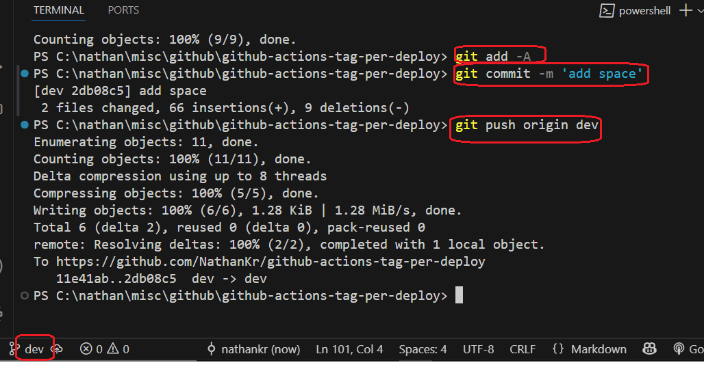

<h1>Project Name</h1>
Versioned Deployments

<h2>Project Description</h2>
"Versioned Deployments" provides a streamlined approach to uniquely identify each application deployment to production. By leveraging GitHub Actions' automatically incrementing `run_id`, this workflow creates a specific Git tag for every push to `main` and makes that tag available as an environment variable within your application. This system ensures precise traceability for debugging, internal version display, and documenting specific content versions.

<h2>Motivation</h2>
You deploy your app to production and want unique tag for each deploy. This is not in the manner of major.minor.xxx which is set manually and not neceseraly when deploy to production.

Why do u need this autogenerated ?

- becasue app deployed to productiom have bugs so you need to relate these bug to the version it was deployed
- because you want to see in admin page the current unique version
- because you might need the version of disclaimer for documenting version of disclaimer sign bu people login. so the tag can identify uniquely the content signed on

<h2>Installation</h2>
create a branch e.g. dev

<h2>Usage</h2>
work on dev and push to origin dev
go to the dashboard and create pull request to push to main
the work flow is executed

<h2>Technologies Used</h2>
<ul>
<li>github actions</li>
</ul>

<h2>Design</h2>
Questions

<h3>unique tag<h3>
use run id - auto generated and incremented by github action per push

<h3>relate tag to code<h3>
workflow write the tag to env variable which is used by the app

<h2>Code Structure</h2>

<h3>index.js</h3>

```ts
console.log(`TAG_NAME : ${process.env.TAG_NAME}`);
```

<h3>simple-build-id-tagging.yml</h3>

```yml
name: Simple Build ID Tagging (No README)

on:
  push:
    branches:
      - main # Triggers on pushes to the 'main' branch
    paths-ignore:
      - "README.md" # This line prevents the workflow from running if only the README.md file is changed

jobs:
  tag-and-env:
    runs-on: ubuntu-latest # The environment where the job runs

    # Required permission to push tags back to your repository
    permissions:
      contents: write

    steps:
      - name: Checkout code
        uses: actions/checkout@v4 # Gets your repository's code
        with:
          fetch-depth: 0 # Essential for Git tagging operations

      - name: Set TAG_NAME environment variable
        # This line now makes the full tag name (e.g., 'run-1234567890')
        # available as 'TAG_NAME' for subsequent steps and your Next.js build.
        run: echo "TAG_NAME=run-${{ github.run_id }}" >> $GITHUB_ENV

      - name: Configure Git user
        # Git requires a user name and email to create tags
        run: |
          git config user.name "github-actions[bot]"
          git config user.email "github-actions[bot]@users.noreply.github.com"

      - name: Create and push Git tag
        # Creates an annotated tag named 'run-<run_id>' on the current commit
        # and pushes it to your GitHub repository.
        run: |
          TAG_NAME="run-${{ github.run_id }}"
          git tag -a $TAG_NAME -m "Build tag for run ID: ${{ github.run_id }}"
          git push origin $TAG_NAME

      - name: run the app and see the env variable set
        run: npm run dev # Invoke 'npm run dev' on the runner
```

<h2>Demo</h2>

create a change on dev and push


on the github dashboard create pull request to push to main


follow this by click on the button "Merge Pull Request" and "Confirm Merge"


Now the code is in main branch and the workflow simple-build-id-tagging.yml start

You can see the results under actions tab


and you can see the tag env : run-15269136691


and under tags : run-15269136691


<h2>References</h2>
<ul>
       <li><a href='https://youtu.be/x239z6DdE0A?si=Y0pzO1AkyiMUoe-T'> Introduction to <code>GitHub Actions</code>: Learn Workflows with Examples </a>. Here we have same worflows as in this repo</li>
</ul>
